# WuXiaAndJiangHu_Godot 武侠和江湖  godot开发笔记

## 抱歉，天天换开发工具。
*  在用love2d框架开发中，发现点问题。如发布和添加广告，第三方SDK支持等。
* 而且因为love2d的用户群体过少，自己编程水平很一般，遇到的问题难以解决，比如想加个广告。。
* 考虑到游戏最终发布，忍痛换工具，近期在学习godot游戏引擎。
* love2d还是很好用的，很适合学习，做工具，还会继续密切关注。


## 已经基本掌握godot引擎
* 通过学习官网教程，和网上一些教程。目前已经基本掌握godot。
* 游戏的整体框架思路，已经逐渐定型，素材收集也差不多。换引擎不会影响太多。
* godot引擎，目前用起来，感觉不错。很顺手。

## 开发随笔
* RPGmaker类行走图素材处理
  
  含金量不高，只是作为自己的一点记录。
  注：绝大数素材来源于网络，仅为学习使用（极个别是自己绘制的）

  1. 行走图素材
   
   

  2. 新建Sprite，将序列图纹理素材导入
   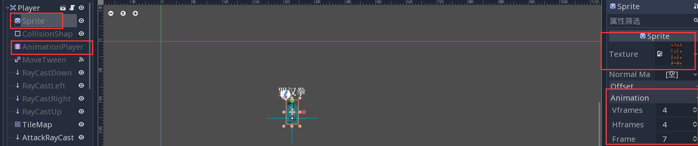
  3. 新建AnimationPlayer，新建4个方向的行走动画
  4. 点击frame右边的钥匙标记，可以快速添加动画 
   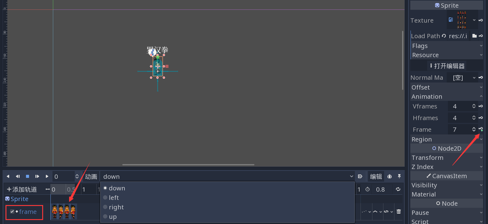
  5. 添加RayCast射线检测，用于简单碰撞
   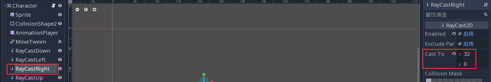
  6. 添加脚本，实现控制，脚本未做清理
   
   ```JavaScript
    extends Area2D
    export(int) var head_id = 0
    var tile_size = 32
    var can_move = true
    var facing = 'right'
    var moves = {'right': Vector2(1, 0),
    			 'left': Vector2(-1, 0),
    			 'up': Vector2(0, -1),
    			 'down': Vector2(0, 1)}
    var raycasts = {'right': 'RayCastRight',
    				'left' : 'RayCastLeft',
    				'up': 'RayCastUp',
    				'down': 'RayCastDown'}

    func move(dir):
    	if get_node(raycasts[facing]).is_colliding():
    		return
    	facing = dir
    	can_move = false
    	$AnimationPlayer.play(facing)
    	$MoveTween.interpolate_property(self, "position", position,
    								position + moves[facing] * tile_size, 0.6,
    								Tween.TRANS_LINEAR, Tween.EASE_IN_OUT)
    	$MoveTween.start()
    	return true

    func _on_MoveTween_tween_completed( object, key ):
    	can_move = true

    ```

* RPGmaker类自动地图在godot中使用
  
  1. 新建Tiledmap，新建TileSet，设置合适的cell大小
  2. 注意：rpgmaker类，自动地图，表面是32*32大小，但在实际处理时，底层是再次分解为16*16计算的，因此这里需要设置为16*16
  3.  点击tilemap里面的tileset下面的"打开编辑器"
  4.  新建autotile，设置snap options里面的 step为16*16，设置bitmask(这里是自动地图的关键)，如图测试，如果不对可以重新编辑

        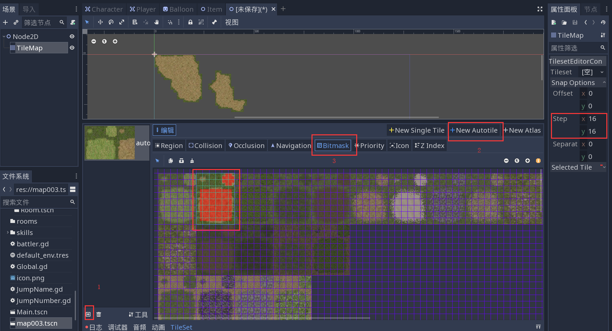
  5.  注意图中的例子并不完整，剩下的需要自己摸索，下面给点提醒
  6.  自动地图，需要底层和表层同时设置才行。像例子中并没有弄底层，只考虑了表层，而且图中的素材为网络拼凑而成，缺少合适的底层，并不可取。
  7.  简单图形的自动地图，如矩形类地毯，可以只管下面的部分，这个时候，cell大小可以设置为32*32，同理snap options里面的 step也可以设置为 32*32。

  

* 基本保存
```JavaScript
func save(content):
    var file = File.new()
    file.open("user://save_game.dat", file.WRITE)
    file.store_string(content)
    file.close()
func load():
    var file = File.new()
    file.open("user://save_game.dat", file.READ)
    var content = file.get_as_text()
    file.close()
    return content
```
* json的基本使用
```JavaScript
var p = JSON.parse('["hello", "world", "!"]')
if typeof(p.result) == TYPE_ARRAY:
    print(p.result[0]) # prints 'hello'
else:
    print("unexpected results")
```
* 读取json数据
  
  假如我们有如下数据，并转为JSON。

  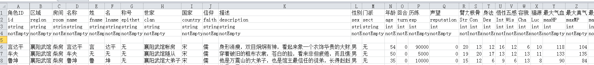

  PS：这里推荐国人制作的excel转lua json等的一个强大工具

    https://github.com/zhangqi-ulua/XlsxToLua

```JavaScript
func load_data(path:String):
	var load_data = File.new()
	if not load_data.file_exists(path):
		print_debug("not exists file")
		return
	
	load_data.open(path,File.READ)

	var data_str = load_data.get_as_text()
	var p = JSON.parse(data_str)
	return p.result
```
* 获取目录下特定后缀文件
```JavaScript
func dir_files(path,suffix):
	var dir = Directory.new()
	var files = []
	if dir.open(path) == OK:
		dir.list_dir_begin()
		var file_name = dir.get_next()
		while (file_name!= ""):
			if dir.current_is_dir():
				print("Found directory" + file_name)
			elif file_name.split(".")[-1] == suffix:
				files.append(file_name)
				print("Found file: " + file_name)
			else:
				print("Found file: " + file_name)
			file_name = dir.get_next()
	else:
		print("An error ccurred when trying to access the path.")
	return files	
```

* 读取文件夹下图片素材生成动画

    假如我们的动画文件在单个文件夹中

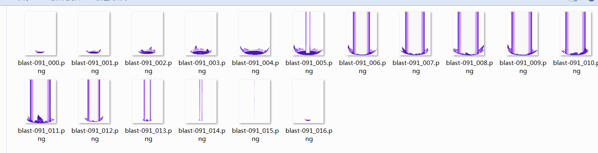

```JavaScript
extends Node2D
# 选择目录下的png
export(String,DIR) var path
export(String) var anim

func _ready():
    $AnimatedSprite.frames = creatAnimation(path)
    $AnimatedSprite.speed_scale = 4
    $AnimatedSprite.play("default")
    pass

func dir_contents(path):
    var dir = Directory.new()
    var file_list = []
    if dir.open(path) == OK:
        dir.list_dir_begin()
        var file_name = dir.get_next()
        while(file_name != ""):
            if dir.current_is_dir():
                print("Found directory: " + file_name)
            else:
                if file_name.split(".")[-1] == "png":
                    file_list.append(file_name)
                    print("Found file: " + file_name)
            file_name = dir.get_next()
    else:
        print("An Error occurred when trying to access the path.")
    return file_list

func creatAnimation(path:String):
    var sprite_sheet = dir_contents(path)
    var sprite_frames = SpriteFrames.new()
    for i in sprite_sheet.size() :
        var frame = load(path + "/" + sprite_sheet[i])
        sprite_frames.add_frame("default",frame)
    return sprite_frames
```

* 利用ninepach简单风格的对话框
  
  一些国产游戏会用到的内圆弧的风格
  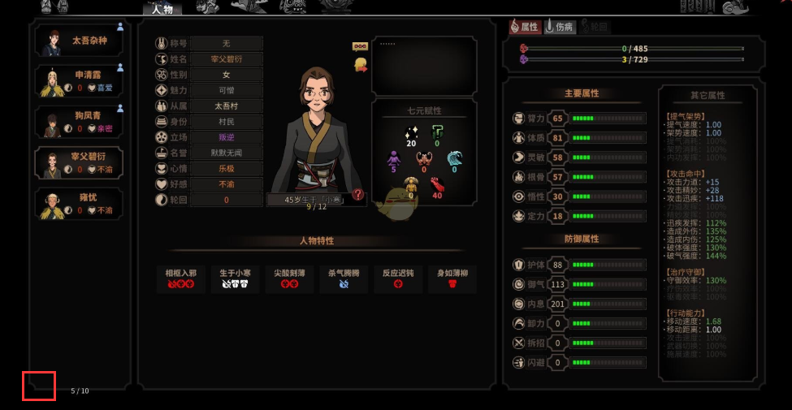
  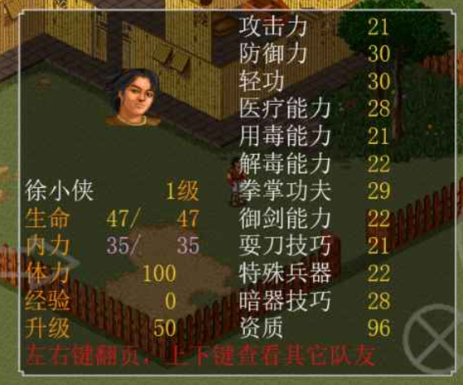
  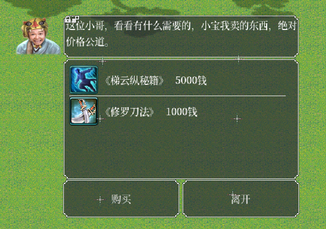

  做这个效果很简单
  1. 准备素材
  
  
  2. 新建NinePatchRect然后设置合适的pachmargin
   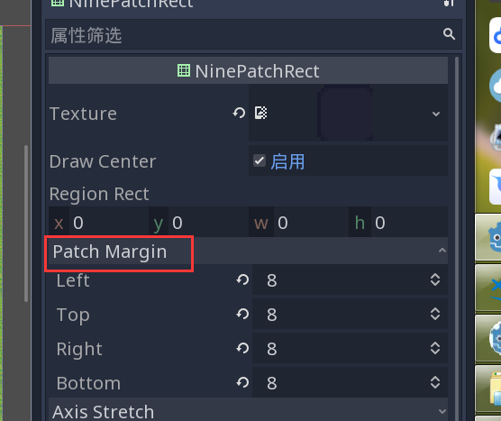
  3. 将其他的控件放到NinePatchRect下。按钮类，可能需要设置flat为true。否则会调用按钮的风格。 也可以以此风格为主，深入修改Theme，那样需要较多的绘制，不擅长，不做累述。
    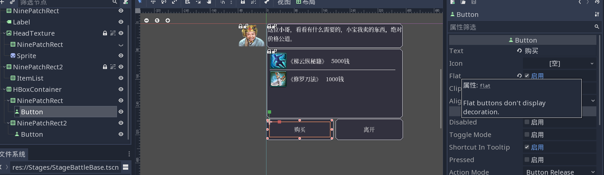

* 用richtextlabel生成物品信息面板
 
  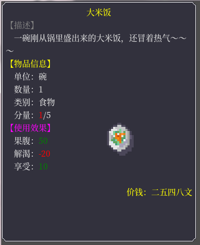
  
  利用到上面的知识，结合richtextlabel
  
  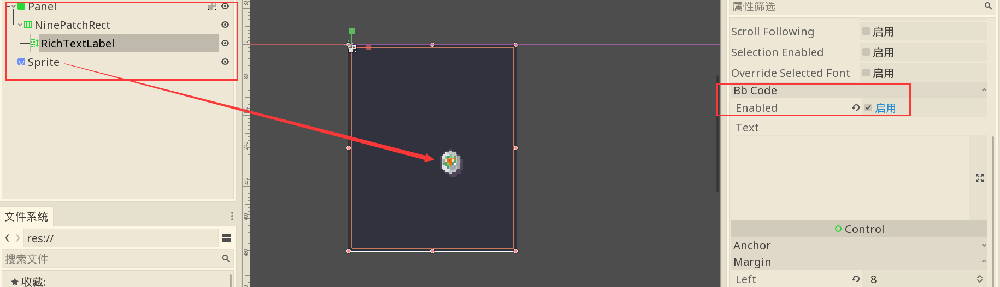

  ```JavaScript
  extends Node2D

    func _ready():
    	$Panel/NinePatchRect/RichTextLabel.bbcode_text = creat_food_bbc()
    	pass # Replace with function body.

    func creat_food_bbc():
    // 用字典模拟物品数据
    	var dict = {}
    	dict.name_cn = "大米饭"
    	dict.direction = "一碗刚从锅里盛出来的大米饭，还冒着热气～～～"
    	dict.unit = "碗"
    	dict.number = "1"
    	dict.type = "食物"
    	dict.pice = 1
    	dict.pice_max = 5
    	dict.food = 50
    	dict.water = -20
    	dict.happy = 10
    	dict.value = 2548
    	
        var bbc ="""[center][color=#ffff00]""" + dict.name_cn + """[/color][/center]
    color=gray]【描述】[/color]
    	""" + dict.direction + """
    color=yellow]【物品信息】[/color]
    	单位："""+ dict.unit +"""
    	数量："""+ str(dict.number) +"""
    	类别："""+ dict.type + """
    	分量：[color=red]""" + str(dict.pice) +"""[/color]/"""+ str(dict.pice_max) +"""
    color=fuchsia]【使用效果】[/color]
    	果腹：[color="""+ get_number_color(dict.food) +"""]"""+ str(dict.food) +"""[/color]
    	解渴：[color="""+ get_number_color(dict.water) +"""]"""+ str(dict.water) +"""[/color]
    	享受：[color="""+ get_number_color(dict.happy) +"""]"""+ str(dict.happy) +"""[/color]
    	[right][color=yellow]价钱："""+ get_chinese_number(dict.value) +"""文[/color][/right]
    	"""
    	return bbc
    // 用于根据数字输出颜色string，这里可以按需要深度更改
    func get_number_color(number):
    	if number < 0: return "red" 
    	else:return "green"
    
    // 用于将数字转化为文字

    func get_chinese_number(n:int):
    	var number_str = str(n)
    	var l = number_str.length()
    	var output = []
    	for i in range(l):
    		number_str[i] = swap_to_font(number_str[i])
    	return number_str
    
    func swap_to_font(number):
    	match number:
    		"1":return "一"
    		"2":return "二"
    		"3":return "三"
    		"4":return "四"
    		"5":return "五"
    		"6":return "六"
    		"7":return "七"
    		"8":return "八"
    		"9":return "九"
    		"0":return "〇"
    		_:return "X"
  ```
* 仿《太吾绘卷》绘制人物关系面板
  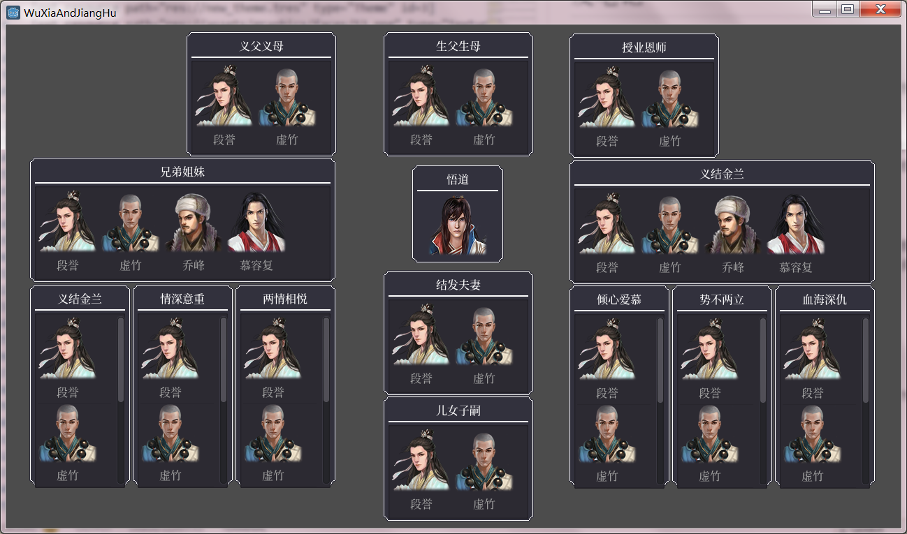

* 制作中国风格时间显示
    
    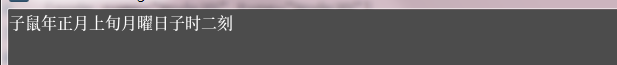
    
```JavaScript
    extends Node2D

    var Date = {year=0,month=0,week=0,day=0,hour=0,minute=0,second=0,   turn=0}
    var animals = ["鼠","牛","虎","兔","龙","蛇","马","羊","猴","鸡","狗    ","猪"]
    var weeks 	= ["上旬","中旬","下旬"]
    var days 	= ["月曜日","火曜日","水曜日","木曜日","金曜日","土曜日","  日曜日"]
    var hours 	= ["子","丑","寅","卯","辰","巳","午","未","申","酉","戌    ","亥"]
    var minutes = ["一刻","二刻","三刻","四刻","五刻","六刻","七刻","八刻   ","九刻"]
    var months  = ["正","二","三","四","五","六","七","八","九","十","冬    ","腊"]
    var numbers = ["〇","一","二","三","四","五","六","七","八","九"]
    var season	= ["春","夏","秋","冬"]
    var monthMsgOut = [	"春天悄悄地走来了，","春风轻轻地拂过你的脸庞，","   天气逐渐变暖了，",
    				"已经是初夏时节了，","知了的叫声让你感觉到了盛夏的气    息，","天气变得非常闷热，",
    				"虽然是秋天了，天气还是有些热，","中秋佳节快到了，","一 阵秋风吹来，卷起了地上的落叶，",
    				"秋去冬来，","寒风凛冽，","快到年关了，"]
    func _ready():
    #	$Label.text = "戊戌年九月二十三日 子时一刻"
    	$Label.text = print_date()
    
    func date_change():
    	Date.second	= Date.second + 6
    	Date.minute = Date.second/60
    	Date.hour 	= Date.minute/120
    	Date.day 	= Date.hour/12
    	Date.week 	= Date.day/7
    	Date.month 	= Date.week/3
    	Date.year 	= Date.month/12
    
    	Date.minute = Date.minute%120
    	Date.hour 	= Date.hour%12
    	Date.day 	= Date.day%7
    	Date.week 	= Date.week%3
    	Date.month 	= Date.month%12
    	Date.year 	= Date.year%12
    	return Date
    
    func _process(delta):
    	# -- 1年 = 12 月 * 3 旬 * 7 天 * 12 时辰 * 120 分 * 60 秒 * 60  帧 = 15552000
    	# -- 计算年月日
    	# -- 6 秒一回合
    	date_change()
    	$Label.text = print_date()
    	pass
    
    func print_date():
    	var yearStr = hours[Date.year] + animals[Date.year]
    	var monthStr = months[Date.month]
    	var weekStr = weeks[Date.week]
    	var dayStr = days[Date.day]
    	var hourStr = hours[Date.hour]
    	var minuteStr = minutes[Date.minute/15%8]
    	var dateStr = ""
    	var dateStr1 = ""
    	dateStr = "{0}年{1}月{2}{3}{4}时{5}".format([yearStr,monthStr,  weekStr,dayStr,hourStr,minuteStr])
    	dateStr1 = "{0}年{1}月{2}日 {3}：{4}".format([str(Date.year),   str(Date.month),str(Date.day),str(Date.hour),str(Date.minute)])
    	return dateStr
```

* 学习武侠MUD，制作room,和room中的任务事件
    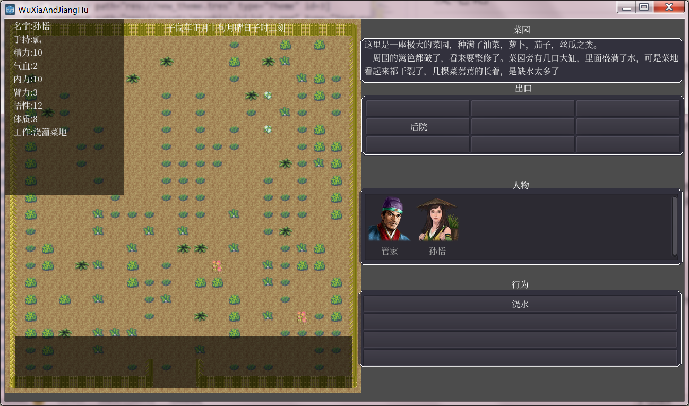
    
    ```JavaScript
        extends Node2D
        class_name Room
        # Declare member variables here. Examples:
        # var a = 2
        # var b = "text"
        var pos_n = Vector2()
        var pos_en = Vector2()
        var pos_e = Vector2()
        var pos_es = Vector2()
        var pos_s = Vector2()
        var pos_ws = Vector2()
        var pos_w = Vector2()
        var pos_wn = Vector2()

        export var pos_1 = Vector2()
        export var pos_2 = Vector2()

        var id:String
        var name_cn:String
        var description:String
        var x:int
        var y:int
        var inside:bool
        var safe:bool
        var actions:Array
        var objs:Array
        var actors:Array
        var exits = {}
        # person
        var weapon1 = {id = "piao",name = "瓢"}
        var mark1 = { jiao = 0}
        var me = {
        	name_cn = "孙悟",
        	weapon = weapon1,
        	mark = mark1,
        	job_name = "浇灌菜地",
        	is_busy = false,
        	is_fighting = false,
        	Con = 8,
        	Str = 3,
        	Int = 12,
        	jingli = 10,
        	qi = 2,
        	force = 10
        		}
        # Called when the node enters the scene tree for the first time.

        func create():
        	id = "wuguan_cai_yuan"
        	name_cn = "菜园"
        	x = 32
        	y = 32
        	inside = false
        	safe = true
        	actions = ["浇水"]
        	objs = ["水缸"]
        	actors = ["管家"]
        	description = """这里是一座极大的菜园，种满了油菜，萝卜，茄子，丝瓜     之类。
        	周围的篱笆都破了，看来要整修了。菜园旁有几口大缸，里面盛满了水，可是        菜地看起来都干裂了，几棵菜蔫蔫的长着，是缺水太多了"""
        	# test 

        func _ready():
        	$Label.text = name_cn
        	position.x = x
        	position.y = y
        	create()
        	$Label.text = name_cn
        	$NinePatchRect/Description.text = description
        	$NinePatchRect4/VBoxContainer/ActionButton01.text = "浇水"

        	pass # Replace with function body.

        func do_jiao():
        	var me = self.me
        	var weapon
        	var costj
        	var costq
        	if me.job_name != "浇灌菜地" :
        		return notify_fail("你必须跟馆主领了这工作才能在这里干!")
        	if me.is_busy :
        		return notify_fail("你现在正忙着呢!")
        	if me.is_fighting :
        		return notify_fail("你正在战斗中！")
        	weapon = me.weapon
        	if me.weapon.id != "piao" :
        		return notify_fail("你想用什么来舀水浇，用手吗？")
        	costj = int(rand_range(1,(me.Con/3)))
        	costq = int(rand_range(1,(me.Str/3)))
        	if me.jingli < costj or me.qi < costq :
        		message_vision("[color=red]{name_cn}弯腰到大缸里舀水，结果失        足栽到缸里。[/color]".format(me))
        		return
        	me.jingli = max(0,me.jingli - costj)
        	me.qi = max(0,me.qi - costq)
        	if me.mark.jiao and me.mark.jiao > 15 + int(rand_range(0,5)) :
        		me.mark.wanle = 1
        		message_vision("[color=red]菜园管事说：干的不错，好了，你可以       到大师兄鲁坤那里去覆命了！[/color]")
        		return 1
        	message_vision("[color=green]你用瓢从缸里舀起水，在菜地里浇起水     来。[/color]")
        	add_busy(2.0)
        	me.mark.jiao += 1
        	if me.force < 20 and rand_range(0,10) < 6 :
        		message_vision("[color=yellow]你在浇水中对于内功的用法有些体        会[/color]")
        		me.force = me.force + int(me.Int/10)
        		return 1

        func notify_fail(message:String):
        	$AcceptDialog.show()
        	$AcceptDialog.dialog_text = message
        	pass

        func message_vision(message:String):
        	$RichTextLabel.bbcode_enabled = true
        	$RichTextLabel.bbcode_text = message
        	pass	

        func character_panel(me):
        	var msg:String
        	msg = """	名字:""" + me.name_cn + """
        	手持:""" + me.weapon.name + """
        	精力:""" + str(me.jingli) + """
        	气血:""" + str(me.qi) + """
        	内力:""" + str(me.force) + """
        	臂力:""" + str(me.Str) + """
        	悟性:""" + str(me.Int) + """
        	体质:""" + str(me.Con) + """
        	工作:""" + me.job_name
        	return msg

        func add_busy(time:float):
        	yield(get_tree().create_timer(time),"timeout")

        func _process(delta):
        	$RichTextLabelCharacter.bbcode_text = character_panel(me)
        	pass	

        func _on_ActionButton01_pressed():
        	do_jiao()
        	pass # Replace with function body.
   ```
* 仿<放置江湖> room 之间移动
  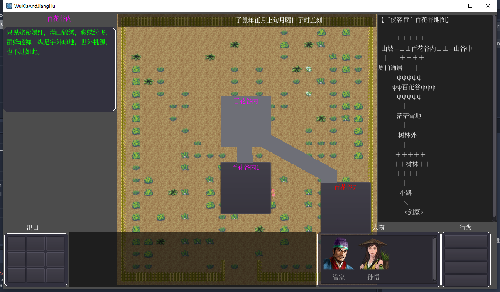

* 仿<放置江湖> 物品信息面板
  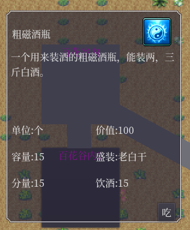

* 游戏UI设计
  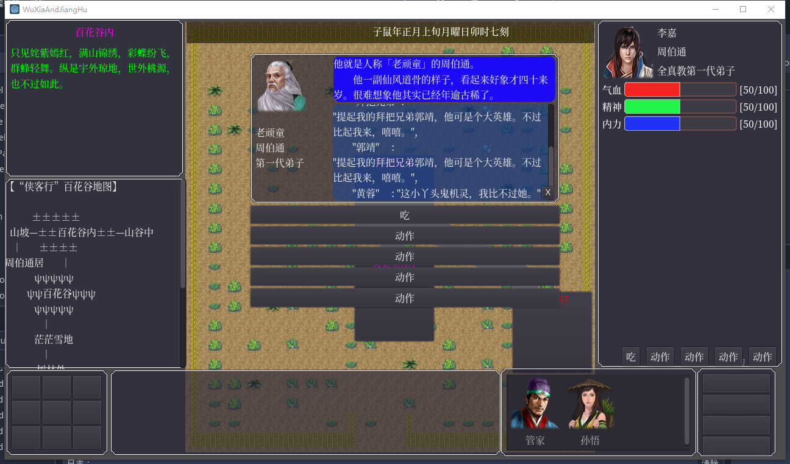  

  ```
		func object_panel(ob:GameObject):
			$ObjcetRect.show()
			$ObjcetRect/Name.bbcode_text = ob.query("name")
			$ObjcetRect/Type.text = ob.query("type")
			$ObjcetRect/Description.bbcode_text = ob.query("long")
			var props = []
			var prop_nodes = []
			prop_nodes.append($ObjcetRect/GridContainer/Prop1)
			prop_nodes.append($ObjcetRect/GridContainer/Prop2)
			prop_nodes.append($ObjcetRect/GridContainer/Prop3)
			prop_nodes.append($ObjcetRect/GridContainer/Prop4)
			prop_nodes.append($ObjcetRect/GridContainer/Prop5)
			prop_nodes.append($ObjcetRect/GridContainer/Prop6)
			prop_nodes.append($ObjcetRect/GridContainer/Prop7)
			prop_nodes.append($ObjcetRect/GridContainer/Prop8)

			props = creat_props(ob)
			for i in props.size() :
				if props[i]:
				var path = "ObjcetRect/GridContainer/Prop" + str(1)
				prop_nodes[i].show()
				prop_nodes[i].text = props[i]

	func creat_props(ob:GameObject):
		var props = []
		for k in ob.attributes:
			match k:
				"unit":
					props.append("单位:" + ob.query(k))
				"value":
					props.append("价值:" + str(ob.query(k)))
				"material":
					props.append("材质:" + ob.query(k))
				"food_remaining":
					props.append("分量:" + str(ob.query(k)))
				"food_supply":
					props.append("饱腹:" + str(ob.query(k)))
				"water_supply":
					props.append("解渴:" + str(ob.query(k)))
				"max_liquid":
					props.append("容量:" + str(ob.query(k)))
				"liquid":
					var liquid = ob.query("liquid")
					for k in liquid:
						match k:
							"name":
								props.append("盛装:" + str(liquid.name))
							"remaining":
								props.append("分量:" + str(liquid.remaining))
							"drunk_supply":
								props.append("饮酒:" + str(liquid.drunk_supply))
							"water_supply":
								props.append("解渴:" + str(liquid.water_supply))
		return props

  ```